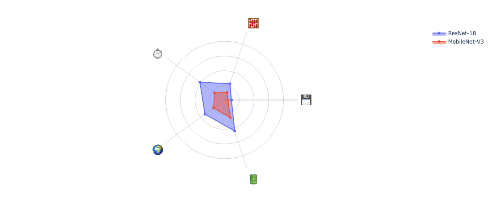

# fasterbench


<!-- WARNING: THIS FILE WAS AUTOGENERATED! DO NOT EDIT! -->

[](https://badge.fury.io/py/fasterbench)
[](https://opensource.org/licenses/Apache-2.0)
[](https://github.com/FasterAI-Labs/fasterbench/actions/workflows/test.yaml)

## Overview

`fasterbench` is a comprehensive benchmarking library for PyTorch models
that helps AI researchers and engineers evaluate model performance
across five critical dimensions:

- **Size**: Model disk size and parameter count
- **Speed**: Latency and throughput on both GPU and CPU
- **Compute**: MACs (multiply-accumulate operations)
- **Memory**: Peak and average memory consumption
- **Energy**: Power consumption and carbon emissions

Whether you’re optimizing for edge deployment, comparing model
architectures, or researching model efficiency, FasterBench provides the
metrics you need with minimal setup.

## Installation

``` bash
pip install fasterbench
```

## Quick Start

``` python
import torch
from torchvision.models import resnet18
from fasterbench import benchmark

# Load your model
model = resnet18()

# Create sample input
dummy_input = torch.randn(1, 3, 224, 224)

# Run comprehensive benchmarks
results = benchmark(model, dummy_input)

# Print results
for metric, value in results.items():
    print(f"{metric}: {value}")
```

## Features

### All-in-one Benchmarking

Get comprehensive metrics with a single function call:

``` python
# Measure all metrics
results = benchmark(model, dummy_input)

# Or select specific metrics
results = benchmark(model, dummy_input, metrics=["size", "speed"])
```

### Size Metrics

Evaluate model size characteristics:

``` python
from fasterbench import compute_size

size_metrics = compute_size(model)
print(f"Disk Size: {size_metrics.size_mib:.2f} MiB")
print(f"Parameters: {size_metrics.num_params:,}")
```

### Speed Metrics

Measure inference performance across devices:

``` python
from fasterbench import compute_speed_multi

speed_metrics = compute_speed_multi(model, dummy_input)
for device, metrics in speed_metrics.items():
    print(f"{device} latency (P50): {metrics.p50_ms:.2f} ms")
    print(f"{device} throughput: {metrics.throughput_s:.2f} inferences/sec")
```

### Compute Metrics

Quantify computational complexity:

``` python
from fasterbench import compute_compute

compute_metrics = compute_compute(model, dummy_input)
print(f"MACs: {compute_metrics.macs_m} million")
```

### Memory Metrics

Profile memory usage:

``` python
from fasterbench import compute_memory_multi

memory_metrics = compute_memory_multi(model, dummy_input)
for device, metrics in memory_metrics.items():
    print(f"{device} peak memory: {metrics.peak_mib:.2f} MiB")
```

### Energy Metrics

Measure environmental impact:

``` python
from fasterbench import compute_energy_multi

# Requires codecarbon package
energy_metrics = compute_energy_multi(model, dummy_input)
for device, metrics in energy_metrics.items():
    print(f"{device} power usage: {metrics.mean_watts:.2f} W")
    print(f"{device} CO2: {metrics.co2_eq_g:.6f} g CO₂-eq per inference")
```

### Thread Count Optimization

Find the optimal number of CPU threads:

``` python
from fasterbench import sweep_threads

thread_results = sweep_threads(model, dummy_input, thread_counts=[1, 2, 4, 8, 16])
for result in thread_results:
    print(f"Threads: {result['threads']}, Latency: {result['mean_ms']:.2f} ms")
```

### Visualize Results

Create radar plots to compare multiple models:

``` python
from fasterbench.benchmark import benchmark
from fasterbench.plot import *
from torchvision.models import resnet18, mobilenet_v3_large
import torch

dummy = torch.randn(8,3,224,224)

resnet   = benchmark(resnet18(),            dummy,
                     metrics=("size","speed","compute","energy"))
mobilenet= benchmark(mobilenet_v3_large(),  dummy,
                     metrics=("size","speed","compute","energy"))
```

``` python
fig = create_radar_plot([resnet, mobilenet],
                        model_names=["ResNet-18", "MobileNet-V3"])
fig.show()
```



## Documentation

For more detailed usage examples and API documentation, visit our
[documentation](https://github.com/nathanhubens/fasterbench).

## Contributing

Contributions are welcome! Please feel free to submit a Pull Request.

## License

This project is licensed under the Apache 2.0 License - see the LICENSE
file for details.
