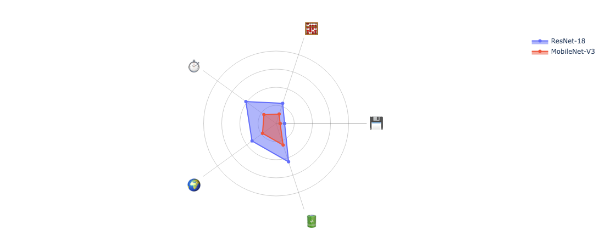

# fasterbench


<!-- WARNING: THIS FILE WAS AUTOGENERATED! DO NOT EDIT! -->

[](https://badge.fury.io/py/fasterbench)
[](https://opensource.org/licenses/Apache-2.0)
[](https://github.com/FasterAI-Labs/fasterbench/actions/workflows/test.yaml)

## Overview

`fasterbench` is a comprehensive benchmarking library for PyTorch models
that helps AI researchers and engineers evaluate model performance
across five critical dimensions:

- **Size**: Model disk size and parameter count
- **Speed**: Latency and throughput on both GPU and CPU
- **Compute**: MACs (multiply-accumulate operations)
- **Memory**: Peak and average memory consumption
- **Energy**: Power consumption and carbon emissions

Whether you’re optimizing for edge deployment, comparing model
architectures, or researching model efficiency, FasterBench provides the
metrics you need with minimal setup.

## Installation

``` bash
pip install fasterbench
```

## Quick Start

``` python
import torch
from torchvision.models import resnet18
from fasterbench import benchmark

# Load your model
model = resnet18()
dummy_input = torch.randn(1, 3, 224, 224)

# Run comprehensive benchmarks
result = benchmark(model, dummy_input, metrics=["size", "speed", "compute"])

# Typed access (IDE autocomplete!)
print(f"Size: {result.size.size_mib:.2f} MiB")
print(f"Params: {result.size.num_params:,}")
print(f"CPU Latency: {result.speed['cpu'].mean_ms:.2f} ms")
print(f"MACs: {result.compute.macs_m}M")

# Backward-compatible dict access still works
print(result["size_disk_bytes"])
```

## Features

### BenchmarkResult: Typed Access + Backward Compatibility

The
[`benchmark()`](https://FasterAI-Labs.github.io/fasterbench/benchmark.html#benchmark)
function returns a
[`BenchmarkResult`](https://FasterAI-Labs.github.io/fasterbench/benchmark.html#benchmarkresult)
object with both typed attribute access and dict-like access:

``` python
result = benchmark(model, dummy_input, metrics=["size", "speed", "compute"])

# Typed access - IDE autocomplete and type checking
result.size.size_mib          # 44.59
result.size.num_params        # 11689512
result.speed["cpu"].mean_ms   # 45.23
result.speed["cpu"].throughput_s  # 22.1
result.compute.macs_m         # 1819.066
result.compute.macs_available # True (False if MACs couldn't be computed)

# Dict access - backward compatible with existing code
result["size_size_mib"]       # 44.59
result["speed_cpu_mean_ms"]   # 45.23
for key, value in result.items():
    print(f"{key}: {value}")
```

### Human-Readable Summary

Get a quick overview with formatted output:

``` python
result.summary()  # prints directly
```

    ═══ Size ════════════════════════════════════
      Disk:   44.59 MiB
      Params: 11.69M
    ═══ Speed ═══════════════════════════════════
      cpu: 45.23 ms  │  22.1 inf/s  │  p99: 48.12 ms
    ═══ Compute ═════════════════════════════════
      MACs:   1819.1 M
      Params: 11.69 M

### Export to DataFrame or JSON

``` python
# Convert to pandas DataFrame for analysis
df = result.to_dataframe()
df.to_csv("benchmark_results.csv")

# Serialize to JSON
json_str = result.to_json()

# Get formatted string (for logging, etc.)
summary_str = str(result)
```

### Selective Metrics

Only compute what you need:

``` python
# Fast: just size and compute (no inference runs)
result = benchmark(model, dummy_input, metrics=["size", "compute"])

# Full benchmark on specific devices
result = benchmark(model, dummy_input, 
                   speed_devices=["cpu", "cuda"],
                   memory_devices=["cuda"])
```

### Individual Metric Functions

For fine-grained control, use the individual compute functions:

``` python
from fasterbench import compute_size, compute_speed_multi, compute_compute

# Size metrics
size = compute_size(model)
print(f"Disk Size: {size.size_mib:.2f} MiB")
print(f"Parameters: {size.num_params:,}")

# Speed metrics across devices
speed = compute_speed_multi(model, dummy_input)
for device, metrics in speed.items():
    print(f"{device}: {metrics.mean_ms:.2f}ms, {metrics.throughput_s:.1f} inf/s")

# Compute metrics (MACs)
compute = compute_compute(model, dummy_input)
if compute.macs_available:
    print(f"MACs: {compute.macs_m}M")
```

### Memory Metrics

Profile memory usage on CPU and GPU:

``` python
from fasterbench import compute_memory_multi

memory = compute_memory_multi(model, dummy_input)
for device, metrics in memory.items():
    print(f"{device} peak: {metrics.peak_mib:.2f} MiB")
```

### Energy Metrics

Measure power consumption and carbon footprint (requires `codecarbon`):

``` python
from fasterbench import compute_energy_multi

energy = compute_energy_multi(model, dummy_input)
for device, metrics in energy.items():
    print(f"{device}: {metrics.mean_watts:.1f}W, {metrics.co2_eq_g:.4f}g CO₂/inf")
```

### Thread Sweep for CPU Optimization

Find the optimal thread count for CPU inference:

``` python
from fasterbench import sweep_threads

results = sweep_threads(model, dummy_input, thread_counts=[1, 2, 4, 8])
for r in results:
    print(f"{r['threads']} threads: {r['mean_ms']:.2f}ms")
```

### Visualize Results

Create radar plots to compare multiple models:

``` python
from fasterbench.benchmark import benchmark
from fasterbench.plot import *
from torchvision.models import resnet18, mobilenet_v3_large
import torch

dummy = torch.randn(8,3,224,224)

resnet   = benchmark(resnet18(),            dummy,
                     metrics=("size","speed","compute","energy"))
mobilenet= benchmark(mobilenet_v3_large(),  dummy,
                     metrics=("size","speed","compute","energy"))
```

``` python
fig = create_radar_plot([resnet, mobilenet],
                        model_names=["ResNet-18", "MobileNet-V3"])
fig.show()
```



## Documentation

For more detailed usage examples and API documentation, visit our
[documentation](https://github.com/nathanhubens/fasterbench).

## Contributing

Contributions are welcome! Please feel free to submit a Pull Request.

## License

This project is licensed under the Apache 2.0 License - see the LICENSE
file for details.
